<!--
  ESTE ARCHIVO SE GENERA AUTOMÁTICAMENTE con scripts/generar.py a partir de perfil.toml.
  Para cambiar el contenido, edita perfil.toml (guía: docs/MANTENIMIENTO.md).
-->

Ingeniero en Sistemas Computacionales con posgrado en Administración de Tecnologías. Trabajo en soporte e implementación de TI, redes y bases de datos, y hoy enfoco mis proyectos en la ciberseguridad defensiva con Python.

**Construyendo ahora:** ALBA, un kit local para revisar la seguridad de proyectos, y nuevas herramientas para mi laboratorio de ciberseguridad en Python.

<b>English summary</b>

Computer Systems Engineer (UNINTER) with a postgraduate degree in Technology Management. Hands-on experience in IT support and implementation (BBVA Technology, international clients), networking (government agencies) and production test databases (Marelli). I am currently building defensive security tools in Python: ALBA, a local project security reviewer, and a cybersecurity lab focused on log analysis. Spanish (native) · English (B2).

<h3><picture><source media="(prefers-color-scheme: dark)" srcset="assets/secciones/proyectos-oscuro.svg"><source media="(prefers-color-scheme: light)" srcset="assets/secciones/proyectos-claro.svg"></picture></h3>

<table>
<tr>
<td width="50%" valign="top">

Aplicación local en español para revisar la seguridad de proyectos web y Node.js y aprender mientras lo haces. Funciona sin internet y solo usa la biblioteca estándar de Python.

<b>Cómo funciona</b>

<ul><li>Eliges una carpeta (o el proyecto ficticio del laboratorio) y antes de empezar ves el alcance: qué va a leer, siempre en modo de solo lectura.</li><li>Busca secretos expuestos (16 reglas específicas + 1 genérica), configuraciones peligrosas (CORS, TLS, eval/exec, cookies, Docker) y dependencias con avisos conocidos. Si tienes Gitleaks, lo usa como segundo detector.</li><li>Cada hallazgo separa hechos, indicios e hipótesis. Los secretos nunca se muestran completos: prefijo, longitud y huella HMAC.</li><li>Propone correcciones acotadas con vista previa, aprobación ligada al cambio exacto, respaldo, verificación y reversión.</li><li>Exporta informes en HTML, Markdown y JSON.</li></ul>

Probado en Ubuntu 24.04 (base de Linux Mint 22). Windows y macOS: prototipo. El resto del kit está diseñado y marcado como pendiente.

<a href="https://github.com/AlfonsoCha1/Herramientas_cyberseguridad"><b>Repositorio</b></a>

</td>
<td width="50%" valign="top">

Laboratorio de ciberseguridad defensiva en Python: herramientas pequeñas e independientes, cada una con código, datos sintéticos, pruebas automáticas y guía. Son herramientas de aprendizaje, no productos para producción.

<b>Cómo funciona</b>

<ul><li>08 · Generador de reportes: convierte eventos JSON, JSON Lines o CSV en reportes Markdown y HTML, y lista las filas que no pudo usar.</li><li>09 · Contador de intentos de login: cuenta accesos exitosos y fallidos por usuario e IP en registros de OpenSSH y otros formatos.</li><li>11 · Buscador en logs: busca palabras, IPs, rangos de red (CIDR) y fechas con líneas de contexto, sin cargar el archivo completo.</li><li>12 · Detector de múltiples accesos: alerta cuando una cuenta o IP acumula demasiados fallos en una ventana de tiempo, con evidencia.</li><li>Un menú (python menu.py) ejecuta las demostraciones y las pruebas de cada herramienta.</li></ul>

Las otras 10 herramientas se publican por entregas.

<a href="https://github.com/AlfonsoCha1/Tipos-de-Proyectos/tree/main/ciberseguridad"><b>Repositorio</b></a>

</td>
</tr>
<tr>
<td width="50%" valign="top">

Asistente de inteligencia artificial en español, en beta gratuita. Ayuda a investigar, redactar, analizar datos y pensar ideas de negocio.

<b>Cómo funciona</b>

<ul><li>Chat con memoria dentro de la conversación y entre sesiones; la memoria se puede exportar.</li><li>Voz: dictado y respuestas habladas.</li><li>Investigación web y modo de trabajo autónomo.</li><li>Herramientas de correo y agenda, y búsqueda de empleo.</li></ul>

Código privado: el enlace lleva a la aplicación.

<a href="https://ia-sophya.vercel.app/"><b>Visitar sitio</b></a> · código privado

</td>
<td width="50%" valign="top">

Practica inglés hablando con un coach de IA: te escucha, te corrige y te hace repetir las palabras difíciles.

<b>Cómo funciona</b>

<ul><li>Eliges un escenario: entrevista de trabajo, conversación cotidiana, viajes, reuniones, presentaciones o negocios.</li><li>Ajustas el nivel (A2 a C1), el estilo de corrección (Profesor o Conversación fluida) y la duración (Corta o Completa).</li><li>Toda la práctica es por voz, sin escribir; al final recibes tus 3 errores principales con ejercicios.</li><li>Un agente de IA decide cada turno; el código funciona con Groq, OpenAI o Anthropic usando una clave propia.</li></ul>

Código privado: el enlace lleva a la aplicación.

<a href="https://english-speaking-coach-nine.vercel.app/"><b>Visitar sitio</b></a> · código privado

</td>
</tr>
<tr>
<td width="50%" valign="top">

Tienda en línea de mi marca de ropa deportiva y casual: playeras, blusas, playeras sin mangas y shorts deportivos.

<b>Cómo funciona</b>

<ul><li>Catálogo por categorías con carrito de compras y favoritos.</li><li>Cuenta de cliente con pedidos, entregas y devoluciones.</li><li>Pago con tarjeta de crédito o débito y Mercado Pago; pago con Stripe.</li></ul>

Código privado: el enlace lleva a la tienda.

<a href="https://smuckys-bychavamon.vercel.app/"><b>Visitar sitio</b></a> · código privado

</td>
<td width="50%" valign="top">

Plataforma de tarjetas de puntos o sellos para pequeños negocios de comida, tiendas y servicios (nombre provisional). Todavía no está lista para negocios reales.

<b>Cómo funciona</b>

<ul><li>Directorio de negocios con categorías y búsqueda.</li><li>Registro de clientes con un QR de mostrador por sucursal; tarjeta web e impresa.</li><li>Paneles para cliente, empleado, dueño y administración; los tickets repetidos se rechazan.</li><li>La demo usa negocios y personas ficticios.</li></ul>

La demo está en un servidor gratuito: puede tardar alrededor de un minuto en despertar.

<a href="https://github.com/AlfonsoCha1/Chavarin_-_Said"><b>Repositorio</b></a> · <a href="https://chavarin-said-lealtad.onrender.com/"><b>Ver demo</b></a>

</td>
</tr>
</table>

<b>Más proyectos, prácticas y ejercicios</b> (8)

<table>
<tr><th align="left">Proyecto</th><th align="left">Qué es</th><th align="left">Enlaces</th></tr>
<tr><td><b>Portafolio web</b> Web</td><td>Mi sitio personal con experiencia, proyectos y CV descargable.</td><td><a href="https://github.com/AlfonsoCha1/portafolio-original"><b>Repositorio</b></a> · <a href="https://portafolio-original-tau.vercel.app/"><b>Ver demo</b></a></td></tr>
<tr><td><b>Restaurante Smucky&#x27;s</b> Práctica web</td><td>Sitio de restaurante con menú por categorías, pedidos y reservaciones.</td><td><a href="https://github.com/AlfonsoCha1/PROYECTO-INTERLIGENCIA-ARTIFICIAL"><b>Repositorio</b></a> · <a href="https://proyecto-interligencia-artificial.vercel.app/"><b>Ver demo</b></a></td></tr>
<tr><td><b>Tipos-bash</b> Automatización</td><td>Scripts .bat para Windows: limpieza automática de archivos temporales y organizador de archivos de producción.</td><td><a href="https://github.com/AlfonsoCha1/Tipos-bash"><b>Repositorio</b></a></td></tr>
<tr><td><b>Java</b> Ejercicios</td><td>Ejercicios de Java: condicionales, bucles, juego de adivinar el número y sistema de descuentos.</td><td><a href="https://github.com/AlfonsoCha1/Java"><b>Repositorio</b></a></td></tr>
<tr><td><b>ESCUELA</b> Ejercicios</td><td>Prácticas escolares en C# y ASP.NET Web Forms.</td><td><a href="https://github.com/AlfonsoCha1/ESCUELA"><b>Repositorio</b></a></td></tr>
<tr><td><b>SUMA</b> Ejercicios</td><td>Ejercicio básico en C# y ASP.NET.</td><td><a href="https://github.com/AlfonsoCha1/SUMA"><b>Repositorio</b></a></td></tr>
<tr><td><b>PROYECTOS</b> Ejercicios</td><td>Ejercicios de HTML, CSS y JavaScript.</td><td><a href="https://github.com/AlfonsoCha1/PROYECTOS"><b>Repositorio</b></a></td></tr>
<tr><td><b>Versiones anteriores del portafolio</b> Web</td><td>portafolio-alfonso, Portafolio y Portafolio_Original: versiones previas de mi sitio personal.</td><td><a href="https://github.com/AlfonsoCha1/portafolio-alfonso"><b>Repositorio</b></a></td></tr>
</table>

→ <a href="https://github.com/AlfonsoCha1?tab=repositories"><b>Ver todos mis repositorios públicos</b></a>

<h3><picture><source media="(prefers-color-scheme: dark)" srcset="assets/secciones/areas-oscuro.svg"><source media="(prefers-color-scheme: light)" srcset="assets/secciones/areas-claro.svg"></picture></h3>

<h3><picture><source media="(prefers-color-scheme: dark)" srcset="assets/secciones/loquese-oscuro.svg"><source media="(prefers-color-scheme: light)" srcset="assets/secciones/loquese-claro.svg"></picture></h3>







<h3><picture><source media="(prefers-color-scheme: dark)" srcset="assets/secciones/formacion-oscuro.svg"><source media="(prefers-color-scheme: light)" srcset="assets/secciones/formacion-claro.svg"></picture></h3>

<b>Cursos y constancias</b> — con enlaces de verificación (16)

**Redes y sistemas**

- **CCNAv7: Redes empresariales, Seguridad y Automatización** — Cisco Networking Academy · academia UNINTER · dic 2023 · certificado de finalización de curso
- **CCNAv7: Introducción a Redes** — Cisco Networking Academy · academia UNINTER · ene 2023 · certificado de finalización de curso
- **CISCO: Redes Empresariales Avanzadas** — UNINTER · nov 2024 · certificado · 81 horas
- **CISCO: Redes Empresariales, Seguridad y Automatización** — UNINTER · oct 2024 · certificado · 81 horas
- **OpenSUSE Linux OS Fundamentals** — EDUCBA · Coursera · sep 2025 · curso en línea · [verificar](https://coursera.org/verify/D66JI5C6CMUL)

**Desarrollo e inteligencia artificial**

- **Diplomado en Inteligencia Artificial Generativa y Automatización** — Top Learning Online · sep 2025 · diplomado · 112 horas
- **Introduction to Git and GitHub** — Google · Coursera · abr 2025 · curso en línea · [verificar](https://coursera.org/verify/85AUMO3S7G8Y)
- **Java (nivel 3)** — TR Network · feb 2026 · constancia
- **Curso de programación en Python** — Asociación de Robótica Aplicada y Ciencias de la Tecnología · ene 2022 · reconocimiento · 16 horas
- **Curso de Robótica Aplicada, nivel avanzado** — Asociación de Robótica Aplicada y Ciencias de la Tecnología · jun – oct 2021 · reconocimiento · 60 horas

**Gestión y metodologías ágiles**

- **Scrum Master Certification: Scrum Methodologies** — LearnQuest · Coursera · jun 2025 · curso en línea · [verificar](https://coursera.org/verify/L4123WTS5IIU)
- **Introduction to Scrum Master Training** — LearnQuest · Coursera · jul 2025 · curso en línea · [verificar](https://coursera.org/verify/J2GU682X9PGQ)

**Otras constancias**

- **Comunicación Digital con Medios Enriquecidos** — UNINTER · oct 2023 · certificado · 54 horas
- **Comunicación Web Interactiva** — UNINTER · nov 2022 · certificado · 54 horas
- **Ofimática** — UNINTER · dic 2021 · certificado · 81 horas
- **3.ª Presentación de Proyectos** — UNINTER · ESCAT · may 2024 · reconocimiento por participación

Los cursos de Coursera son cursos en línea sin créditos académicos. Los cursos de Cisco Networking Academy son certificados de finalización de curso, no la certificación CCNA.

<h3><picture><source media="(prefers-color-scheme: dark)" srcset="assets/secciones/experiencia-oscuro.svg"><source media="(prefers-color-scheme: light)" srcset="assets/secciones/experiencia-claro.svg"></picture></h3>


<b>Funciones de cada puesto</b>

**Técnico de Pruebas** · Marelli  
2026 · Tepotzotlán, Estado de México

- Pruebas funcionales a tarjetas electrónicas en varias etapas: manufactura, antes de la entrega al cliente y verificación posterior.
- Desarrollo y administración de bases de datos para el seguimiento de resultados y de materiales reparados.
- Respaldo de la información de las máquinas de prueba.

**Técnico de Soporte e Implementación TI** · BBVA Technology America  
2025 · Ciudad de México · clientes en Colombia, Venezuela y España

- Soporte técnico a clientes internacionales en un equipo de dos personas.
- Implementación de autenticación biométrica (Face ID y huella digital) para usuarios bancarios.
- Gestión y actualización de credenciales de usuario en Linux.
- Apoyo en el desarrollo en Java del asistente digital de la aplicación bancaria y en servicios de AWS para soporte de infraestructura.

**Técnico en TI (servicio social)** · Junta de Conciliación y Arbitraje  
2023 – 2024 · Cuernavaca, Morelos

- Diagnóstico y solución de problemas de conectividad en más de 50 estaciones de trabajo.
- Configuración y gestión de switches; mantenimiento preventivo y correctivo de equipos.
- Soporte técnico de primer nivel en hardware y software.

**Practicante en TI** · Secretaría de Desarrollo Agropecuario (SEDAGRO)  
2021 · Cuernavaca, Morelos

- Diseño e instalación de cableado estructurado hacia switches de red; ponchado de cables.
- Diagnóstico de fallas de conectividad y configuración de impresoras y periféricos.

<h3><picture><source media="(prefers-color-scheme: dark)" srcset="assets/secciones/laboratorios-oscuro.svg"><source media="(prefers-color-scheme: light)" srcset="assets/secciones/laboratorios-claro.svg"></picture></h3>

<h3><picture><source media="(prefers-color-scheme: dark)" srcset="assets/secciones/contacto-oscuro.svg"><source media="(prefers-color-scheme: light)" srcset="assets/secciones/contacto-claro.svg"></picture></h3>

  
  
  
  

<!-- MANUAL:INICIO -->
<!-- Lo que escribas entre estas dos marcas se conserva cada vez que se regenera el README. -->
<!-- MANUAL:FIN -->

<i>“Technology is not only about building things, but about solving real problems with useful solutions.”</i>

